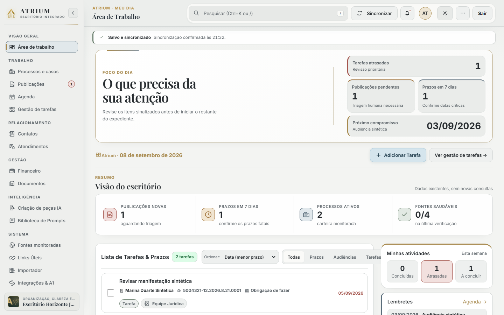
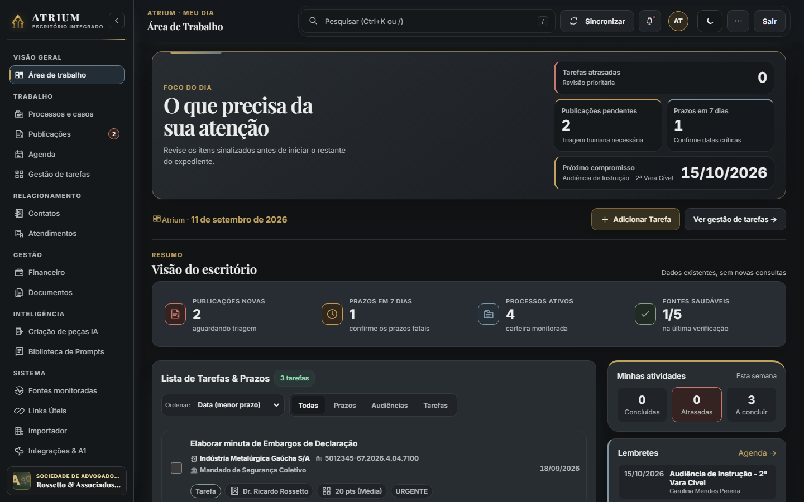
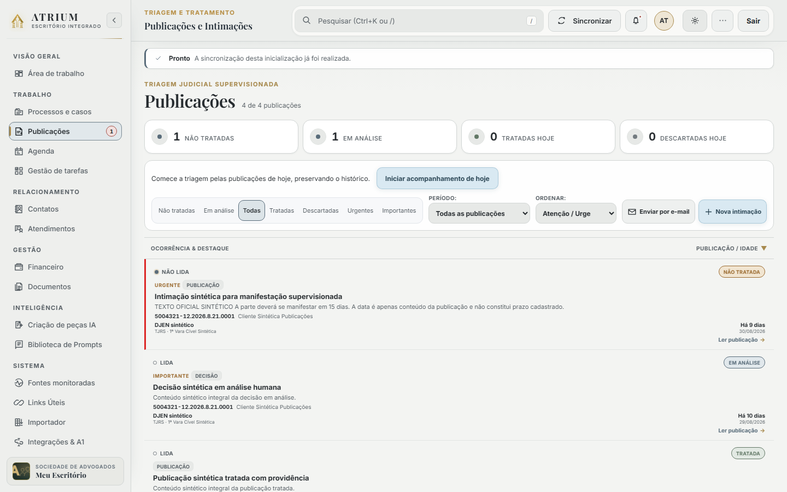

<div align="center">

# ATRIUM — Escritório Integrado

### Gestão jurídica organizada, segura e supervisionada.

[](CHANGELOG.md)
[](docs/RELEASE_NOTES_2.0.0.md)
[](https://nodejs.org/)
[](LICENSE)
[](https://github.com/ricarossetto/Atrium-Senda/actions/workflows/ci.yml)
[](#princípios-do-produto)
[](#segurança)

</div>

## O que é o ATRIUM

O ATRIUM é um workspace jurídico open source e local-first para escritórios brasileiros. Ele reúne processos, publicações, contatos e clientes, CRM, tarefas, agenda, financeiro, documentos, pesquisa, auditoria, assistência por IA e integrações judiciais em um único sistema canônico.

A aplicação roda no computador ou na infraestrutura controlada pelo escritório. A interface V2 é a única interface oferecida ao usuário na versão estável. Decisões jurídicas, confirmação de prazos e atos oficiais continuam sob responsabilidade humana.

## Princípios do produto

- **Local-first:** o ambiente local é o modo principal; o diretório de dados pertence ao escritório.
- **Cifrado:** estado, backups, segredos judiciais e blobs documentais privados usam proteção criptográfica adequada ao contrato de cada camada.
- **Supervisionado:** integrações, enriquecimentos e IA apoiam o trabalho; não substituem conferência profissional.
- **Fonte única de verdade:** um Store canônico mantém entidades e relações, com controle de revisão e conflitos.
- **Relações canônicas:** processos, contatos, tarefas, publicações, documentos e lançamentos financeiros se conectam sem cópias funcionais paralelas.
- **Automação judicial somente de leitura:** autenticação, descoberta e consulta são permitidas; ciência, assinatura e protocolo não são automatizados.

## Visão do produto

<p align="center">
  
  
</p>
<p align="center">
  
  
</p>

Todas as imagens públicas foram produzidas em runtime isolado com dados fictícios. Nenhum dado de cliente, certificado ou publicação real foi usado.

## Funcionalidades

| Área | O que está disponível na versão 2.0.0 |
| --- | --- |
| Dashboard | Visão operacional, indicadores, agenda, publicações e prioridades do escritório |
| Processos | Cadastro CNJ, partes, classe, assunto, órgão, movimentos e navegação cruzada |
| Publicações e intimações | Leitura integral, não lida/lida, triagem, tratamento e criação explícita de tarefa |
| Contatos e clientes | Cadastro único por papéis, vínculos manuais prioritários e reconciliação supervisionada opcional |
| CRM e oportunidades | Atendimento, etapas, responsável, origem e associação a contato canônico |
| Tarefas e Kanban | Fluxo visual, responsáveis, datas, apontamentos e vínculo com processo/publicação |
| Agenda | Compromissos, tarefas, prazos confirmados e calendário externo opcional |
| Documentos | Minutas, acervo privado, upload/download, preview, OCR local e extração de texto |
| Financeiro | Honorários, despesas/custas, reembolsos, RPV/alvarás, status e vínculos processuais |
| Busca global | `Ctrl+K`/`Cmd+K` sobre entidades e conteúdo textual indexável |
| Notificações | Pendências reais do workspace e navegação para o item de origem |
| Auditoria | Registro de ações relevantes, filtros e exportação local |
| Importação e exportação | Planilhas com prévia supervisionada e exportações previstas no produto |
| Monitoramento | Saúde do runtime, fontes e integridade operacional |
| Links úteis | Referências jurídicas organizadas pelo escritório |
| Integrações | DJEN, DataJud, portais, A1, PJeOffice, TOTP, SMTP e calendário externo |
| Configurações | Identidade do escritório, equipe, permissões, preferências e administração |
| Assistente | Google Gemini opcional, contexto minimizado e revisão profissional obrigatória |
| Biblioteca de prompts | Prompts jurídicos reutilizáveis, carregados no assistente sem envio automático |

## Processos e relações canônicas

O número CNJ identifica o processo canônico quando disponível. O registro pode reunir classe, assunto, tribunal, comarca, unidade, partes, cliente/contato, movimentos, tarefas, publicações e documentos. A navegação cruzada abre a mesma entidade relacionada: o cliente exibido leva ao contato canônico, e tarefas e movimentos permanecem associados ao processo.

Dados locais curados têm precedência sobre enriquecimentos externos. Sincronizações não devem apagar silenciosamente informações significativas registradas pelo usuário. Vínculos manuais de cliente sempre prevalecem; a reconciliação assistida só propõe vínculo com confiança mínima de 90%, não transforma advogado ou parte contrária em cliente e funciona sem Gemini, encaminhando ambiguidades para revisão humana.

## Publicações e intimações

Publicações distinguem leitura (`lida`/`não lida`) de tratamento (`untreated`, `in_review`, `treated`, `discarded`). O workspace oferece leitor integral, associação ao processo e criação de tarefa somente por ação explícita.

> Marcar uma publicação como tratada no ATRIUM **não** equivale a dar ciência ou praticar qualquer ato no portal judicial.

## Descoberta judicial

O pipeline conservador é:

```text
DJEN → número CNJ → Processo → enriquecimento DataJud
     → partes estruturadas → Contato → relação de cliente quando houver autoridade
```

Se o DataJud não localizar um processo, os dados básicos provenientes do DJEN são preservados. O ATRIUM não fabrica movimentos, assuntos ou partes ausentes. Uma relação de cliente somente é criada quando dados estruturados e a representação oferecem suporte suficiente; conflitos seguem para revisão humana.

## Integrações judiciais supervisionadas

O ATRIUM suporta certificado A1, PJeOffice, TOTP, sessões interativas/supervisionadas e conectividade gerenciada. A sessão assistida acompanha múltiplas abas e somente considera o login concluído diante de evidência positiva fornecida pelo portal; a janela visível continua sob controle humano. As operações admitidas são autenticação, verificação de saúde, descoberta, leitura de publicações e consulta de movimentos.

O ATRIUM **não** dá ciência, assina, peticiona, protocola, confirma prazo jurídico automaticamente, contorna CAPTCHA ou contorna 2FA. Portais podem exigir login, consentimento, TOTP, CAPTCHA ou outra ação humana. Consulte [Instalação — integrações judiciais](docs/INSTALLATION.md#11-a1-pjeoffice-e-totp) e [Política judicial read-only](specs/judicial-readonly-policy.md).

## Inteligência cadastral brasileira

- **CPF:** validação estrutural exclusivamente local. Não há consulta externa de identidade por CPF configurada por padrão.
- **CNPJ:** formatos numérico legado e alfanumérico; consulta pública pela BrasilAPI.
- **CEP:** BrasilAPI, com ViaCEP como fallback.
- **Bancos:** diretório público para apoio cadastral.
- **Enriquecimento de contatos:** comparação entre valor atual e encontrado, aplicação seletiva, proveniência, freshness/cache e QSA.
- **Duplicidades e conflitos:** sugestões supervisionadas. O sistema não executa merge automático destrutivo nem afirma identidade quando há apenas semelhança.

## Documentos

O acervo usa blobs privados cifrados e metadados no Store canônico. A versão atual inclui upload, download, preview seguro, exclusão lógica, restauração, expurgo explícito, deduplicação por checksum, extração de texto, OCR local quando configurado, derivados textuais/PDF e participação na busca full-text.

Não fazem parte da versão atual: colaboração simultânea, assinatura digital, editor DOCX completo, versionamento jurídico automático e workflow de aprovação documental.

## Pesquisa global

Use `Ctrl+K` no Windows/Linux ou `Cmd+K` no macOS. O índice full-text em memória cobre processos, contatos, publicações, tarefas, documentos e OCR, prompts e metadados de auditoria apropriados. O índice é derivado e reconstruível; não é uma segunda fonte de verdade.

## Segurança

- Estado cifrado com AES-256-GCM, gravação atômica e controle de revisão.
- Senhas protegidas pelo backend; sessão em cookie HttpOnly/SameSite, CSRF e RBAC.
- TOTP opcional por usuário e segredos fora do Store jurídico do frontend.
- Backups `.atrium-backup` cifrados, com checksum SHA-256 e snapshot de segurança antes da restauração.
- Blobs documentais privados e não servidos como arquivos estáticos.
- Credenciais, chaves Gemini, PFX e segredos judiciais não são enviados ao Store do navegador.

Leia [SECURITY.md](SECURITY.md) e as [fronteiras canônicas de segurança](specs/security-boundaries.md).

## Assistência por IA

A integração opcional usa Google Gemini quando uma chave é configurada pelo administrador. Sem chave, o recurso permanece claramente não configurado. A IA é assistiva: respostas e minutas exigem revisão profissional, e nenhuma resposta confirma automaticamente prazo ou decisão jurídica.

## Interface e movimento

A interface V2 segue o sistema visual Mineral Editorial, com temas claro/escuro, layouts responsivos, navegação por teclado, foco visível e respeito a `prefers-reduced-motion`. Microinterações são contidas e não alteram dados ou fluxos funcionais.

## Instalação rápida no Windows

1. Na página da [release v2.0.0](https://github.com/ricarossetto/Atrium-Senda/releases/tag/v2.0.0), baixe **Source code (zip)**.
2. Extraia o ZIP para uma pasta comum do computador.
3. Dê duplo clique em **`ATRIUM.bat`**.
4. Conclua a criação do primeiro administrador no navegador.

O inicializador valida Node.js 24+, Corepack, pnpm 11.19.0, dependências e Chromium. Ele não sobrescreve `.env` nem dados existentes e não inicia um segundo servidor se o ATRIUM já estiver na porta 4173.

Consulte o [manual completo de instalação](docs/INSTALLATION.md).

## Instalação manual

```powershell
git clone https://github.com/ricarossetto/Atrium-Senda.git
cd Atrium-Senda
corepack pnpm install --frozen-lockfile
corepack pnpm exec playwright install chromium
corepack pnpm start
```

Abra `http://127.0.0.1:4173`. Para diagnóstico do instalador Windows, use `ATRIUM.bat --doctor`; para preparar dependências sem iniciar o servidor, use `ATRIUM.bat --install-only`.

## Armazenamento de dados

Por padrão, os dados ficam em `data/` dentro da instalação. Defina `JURISFLOW_DATA_DIR` para usar outro diretório absoluto. `KELLER_DATA_DIR` permanece apenas como compatibilidade interna legada. O diretório de dados e o arquivo `.env` não entram no Git.

Faça backup regular do diretório de dados e exporte backups cifrados antes de atualizar. A chave `AUTH_ENCRYPTION_KEY` é necessária para recuperar o estado e backups cifrados; preserve-a em local seguro separado.

## Backup e restauração

O administrador pode exportar um arquivo `.atrium-backup` cifrado. A restauração valida formato, checksum, schema e migrações e cria um snapshot de segurança do estado corrente antes da troca atômica. Nunca restaure arquivo de origem desconhecida. Veja [Backup e restauração no manual](docs/USER_MANUAL.md#backup-e-restauração).

## Testes e CI

O workflow **Atrium CI** usa Node.js 24, pnpm 11.19.0 e lockfile congelado. Seus jobs são:

- **Lint, Test & E2E Verification**;
- **Multi-Viewport Visual QA**;
- **Judicial A1 Windows Verification**.

A contagem de suítes pertence a cada execução do CI e não é fixada aqui. Testes judiciais públicos usam dados sintéticos; certificados reais nunca fazem parte do repositório.

## Limitações conhecidas

- DJEN, DataJud, BrasilAPI, ViaCEP, Gemini, SMTP e portais dependem da disponibilidade de serviços externos.
- Autenticação em portal pode exigir intervenção humana, PJeOffice, certificado, TOTP ou CAPTCHA.
- Consulta externa de identidade por CPF não é configurada por padrão.
- Confirmação de prazo e qualquer ato processual continuam humanos.
- O ATRIUM não pratica atos judiciais oficiais e não oferece garantia de disponibilidade de terceiros.

## Documentação

- [Instalação](docs/INSTALLATION.md)
- [Manual do usuário](docs/USER_MANUAL.md)
- [Arquitetura](docs/ARCHITECTURE.md)
- [Segurança](SECURITY.md)
- [Especificações do produto](specs/README.md)
- [Changelog](CHANGELOG.md)
- [Notas da release 2.0.0](docs/RELEASE_NOTES_2.0.0.md)
- [Como contribuir](CONTRIBUTING.md)

## Licença

Distribuído sob a [licença MIT](LICENSE).
