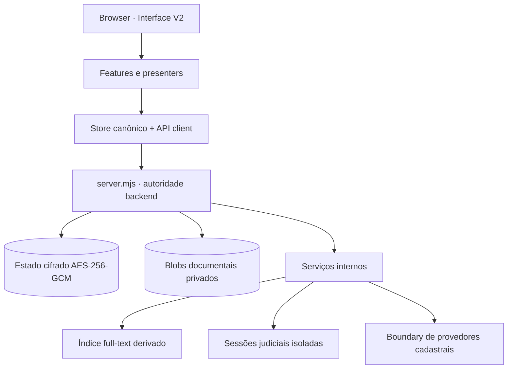
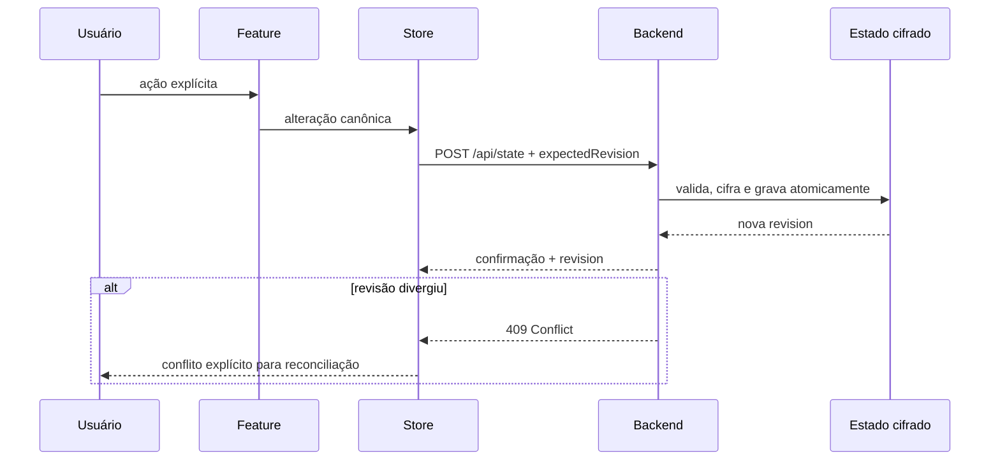
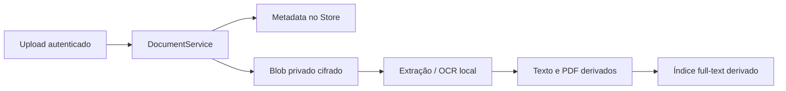
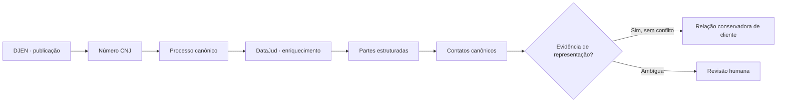
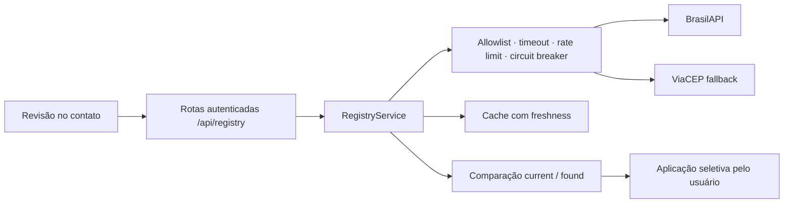
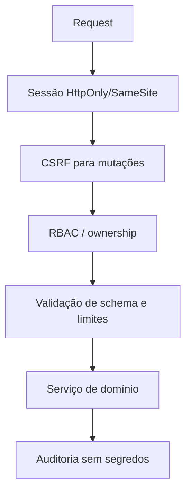

# Arquitetura do ATRIUM 2.0.0

Este documento apresenta as autoridades e fronteiras do sistema. Os contratos normativos detalhados estão em [`specs/`](../specs/README.md); em caso de dúvida, código, testes e specs devem convergir antes de uma mudança.

## Visão geral

A aplicação deliberadamente evita um framework de frontend e mantém uma única instância funcional do App e do Store. Presenters V2 recebem dados e callbacks; eles não criam uma segunda regra de negócio.

## Camadas

### Browser V2

`index.html`, CSS e módulos de `js/views/ui-v2/` formam a interface user-facing. Componentes compartilhados cuidam de modal, drawer, toast, tema, busca, foco e acessibilidade. A apresentação não é fonte de verdade para processos, contatos ou estado de integração.

### Features e controllers

Módulos em `js/features/` encapsulam os contratos de cada domínio e permanecem únicos. Eles recebem Store, rede segura e callbacks por injeção. Presenters podem reorganizar a superfície, mas não duplicam persistência, pesquisa, ordenação ou request flow.

### Store e API

O Store em `js/core/store.js` mantém o estado canônico do frontend, a revisão recebida e a fila/coalescing de persistência. A API em `js/core/api.js` centraliza chamadas autenticadas. Respostas 409 representam concorrência real e não são convertidas silenciosamente em sucesso.

### Backend

`server.mjs` é o runtime canônico iniciado por `pnpm start` e pelo `ATRIUM.bat`. Ele concentra autenticação, autorização, CSRF, persistência, documentos, integrações e orquestração judicial. O launcher não inicia um segundo collector.

## Fonte única e concorrência

O backend é a autoridade de persistência. O estado tem schema/dataVersion/appVersion e passa por migrações determinísticas. Antes de migração/restauração, o sistema cria cópias de segurança quando o contrato exige.

## Persistência cifrada

- Estado canônico em envelope AES-256-GCM.
- `revision` opaca para concorrência otimista.
- Escrita temporária, sincronização e troca atômica.
- Quarentena preservadora quando runtime derivado está corrompido.
- `.atrium-backup` cifrado com checksum e snapshot pré-restauração.
- Segredos locais gerados somente quando ausentes, sem sobrescrever `.env` válido.

O diretório padrão é `data/`; `JURISFLOW_DATA_DIR` seleciona outro local. Veja [store e persistência](../specs/store-persistence.md).

## Documentos

Metadados são canônicos; conteúdo binário fica no provider privado. Download e preview exigem autenticação/autorização e não expõem o diretório como estático. Exclusão lógica, restauração, expurgo e deduplicação por checksum seguem operações distintas. Veja [gestão documental](../specs/document-management.md).

## Busca full-text

O índice em `lib/search-index.mjs` é memória derivada e reconstruível. Ele recebe projeções seguras de processos, contatos, publicações, tarefas, documentos/OCR, prompts e auditoria apropriada. O índice nunca substitui o Store nem persiste uma segunda cópia autoritativa. Veja [busca full-text](../specs/full-text-search.md).

## Descoberta DJEN e DataJud

Falha ou miss do DataJud não apaga a base do DJEN. Campos ausentes não são fabricados. A descoberta não confirma prazo e não pratica ato oficial.

## Sessões judiciais

Credenciais, certificado e TOTP pertencem ao backend/gerenciador seguro, nunca ao Store do navegador. Sessões são separadas por portal e podem usar certificado A1, PJeOffice ou login interativo. O orquestrador aplica locks, cadência, backoff e estado `human_action_required`.

Operações permitidas: autenticação, health, discovery, leitura, movimentos e publicações. São proibidos ciência, assinatura, peticionamento, protocolo, bypass de CAPTCHA/2FA e confirmação automática de prazo. Veja [política read-only](../specs/judicial-readonly-policy.md) e [conectividade gerenciada](../specs/managed-judicial-connectivity.md).

## Provedores cadastrais

CPF usa validação local. CNPJ aceita formato numérico legado e alfanumérico. Respostas externas são normalizadas no backend, com proveniência e sem autoridade automática sobre dados locais. Veja [inteligência cadastral](../specs/brazilian-registry-intelligence.md).

## Integrações externas

- **DJEN/DataJud:** descoberta e enriquecimento judicial somente de leitura.
- **Portais:** sessão supervisionada e isolada, com ação humana quando exigida.
- **SMTP:** transporte único no backend; envios são ações explícitas.
- **Calendário:** leitura de iCalendar/Webcal e merge conservador.
- **Gemini:** status/configuração/chat via backend; chave fora do Store e contexto minimizado.
- **BrasilAPI/ViaCEP:** dados cadastrais públicos sob controles de egress.

## Autoridade de segurança

O backend decide autenticação, permissão e persistência. O frontend não recebe chave privada, senha, segredo TOTP, chave Gemini ou credencial judicial. Rotas estáticas bloqueiam dados, configuração, scripts internos e extensões secretas. Consulte [fronteiras de segurança](../specs/security-boundaries.md).

## Evolução segura

Mudanças devem preservar uma feature por domínio, um Store, revisão explícita, atomicidade, isolamento de segredos e supervisão humana. Novas capacidades começam pela atualização da spec correspondente e por testes dirigidos. Fixtures públicas devem ser inteiramente sintéticas.
